# Ajeda_00P_EnrollmentSystem

---
**Author**: Paul Geneo Ajeda

**1. Encapsulation**

Image:

**2. Service Layer**

**3. Inheritance**

Person:

Instructor:

Student:

**4. Abstraction**

Main:

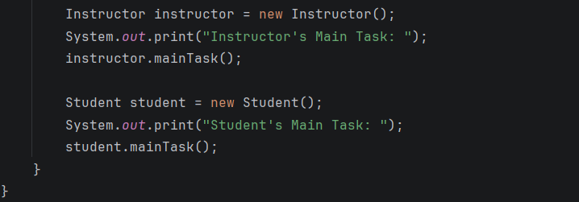

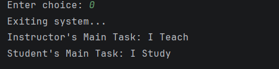

Person:

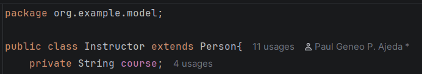

Student: 

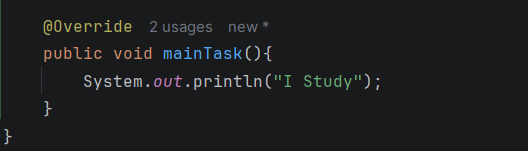

Instructor:

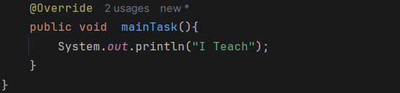

**5. Interface**

Campus Registrar:

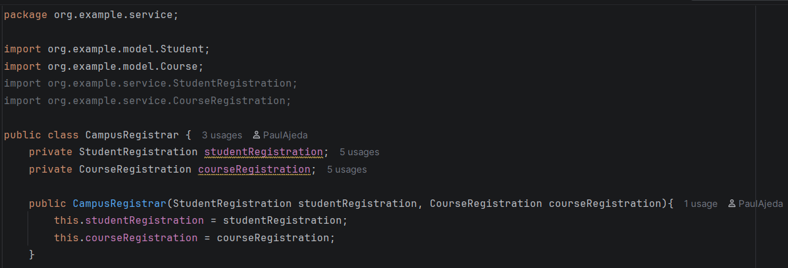

Student:

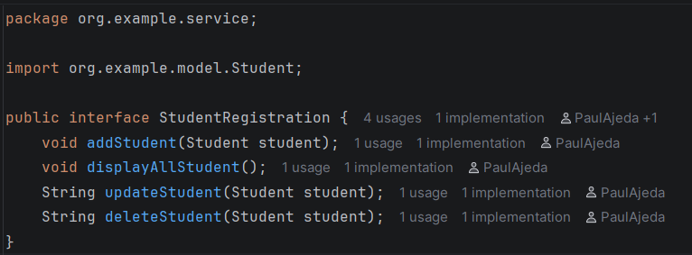
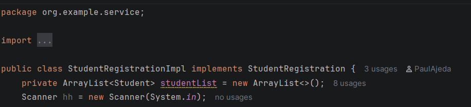

Course: 

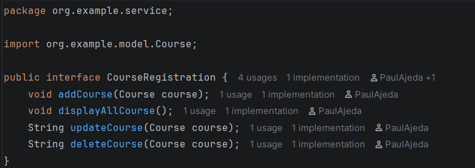
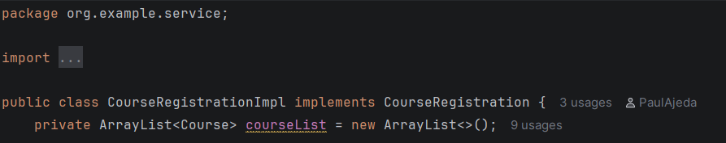

Instructor:

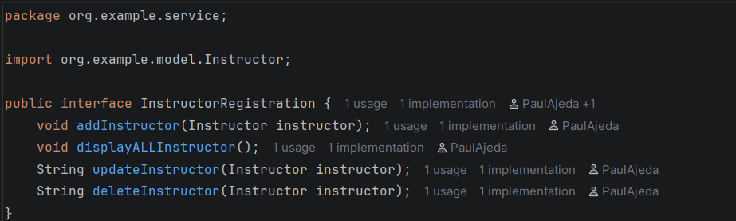
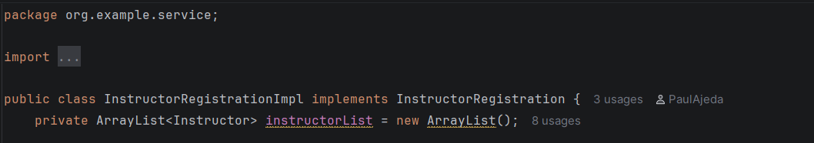

**6. Added Entities**

**[1] Section**

Section

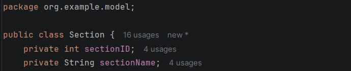

SectionRegistration

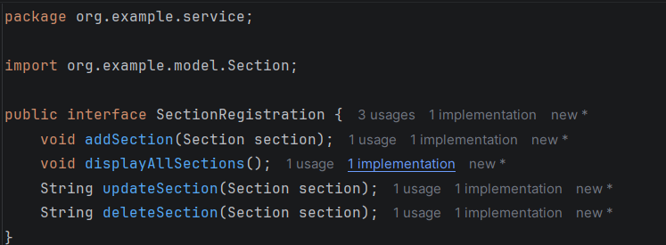

SectionRegistrationImpl

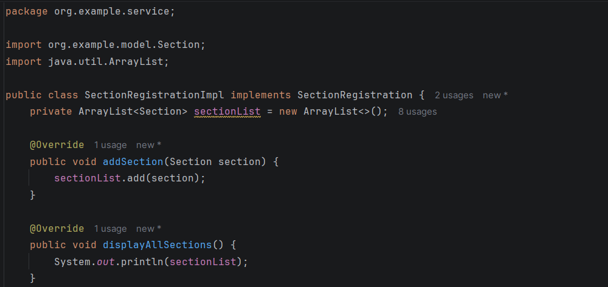

**[2] Department**

Department

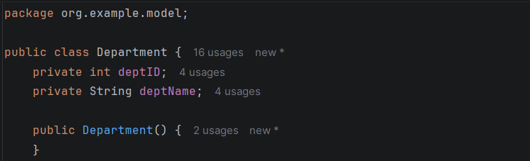

DepartmentRegistration

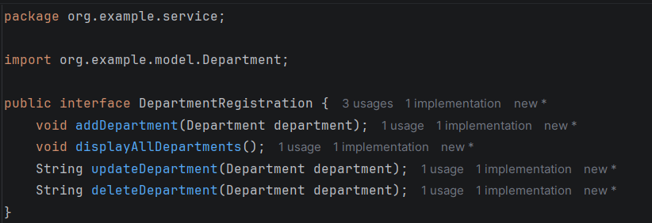

DepartmentRegistrationImpl

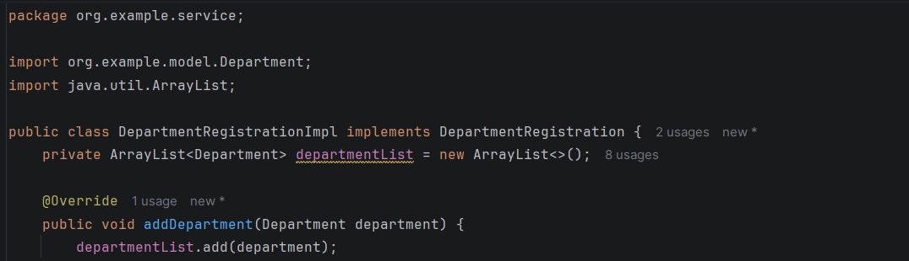

**[3] TuitionFeePayment**

TuitionPayment

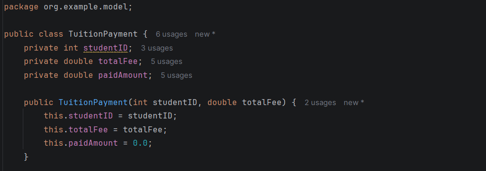

TuitionFeePayment

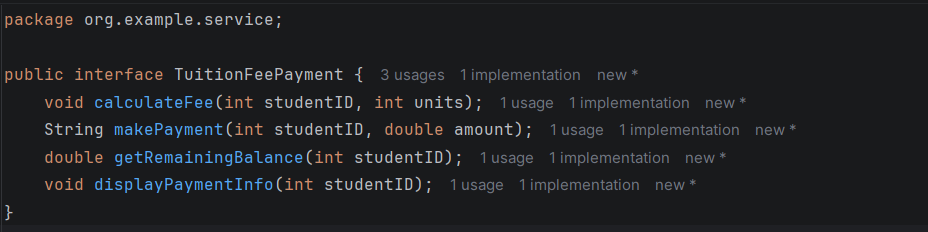

TuitionFeePaymentImpl

**7. Phase 1: The Architectural Shift**

NewEntity-Enrollment

---Interfaces Contracts---

IStudentService:

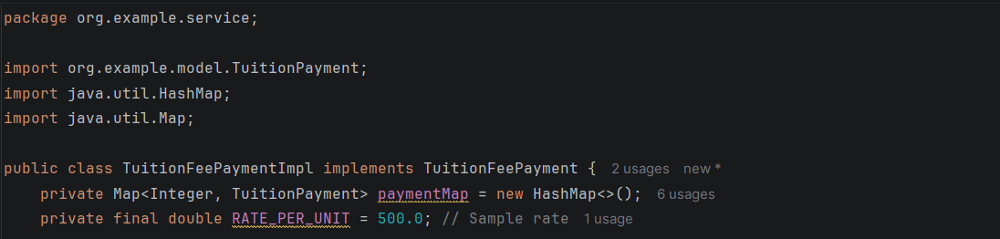

IInstructorService:

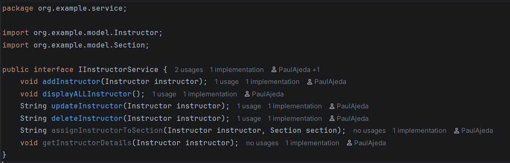

ICourseService: 

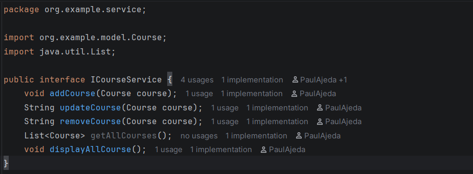

ITuitionService

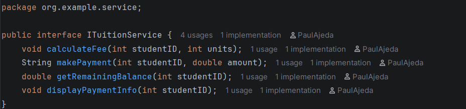

IEnrollmentService:

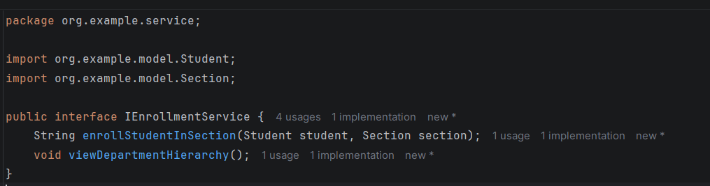

NewEntity-Enrollment Added

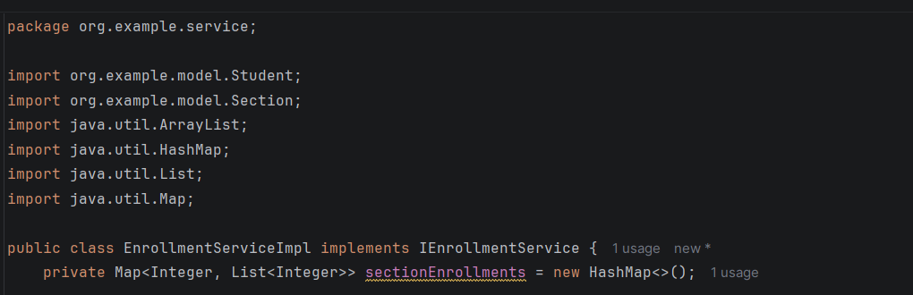

**Phase 2: Minimum Coding Requirements**

Institutional Hierarchy Viewing

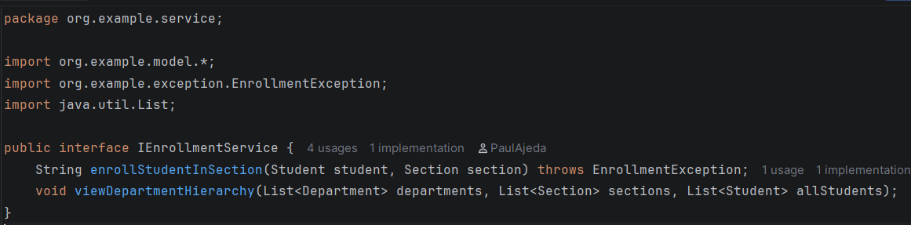

Critical Validation

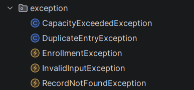
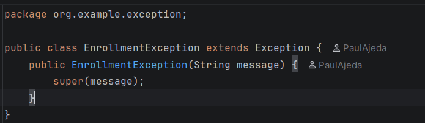
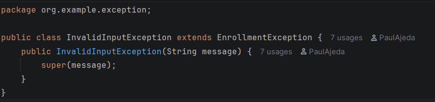
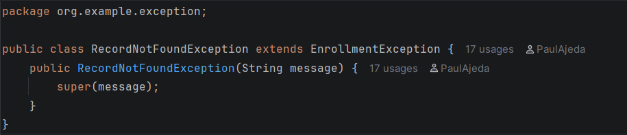
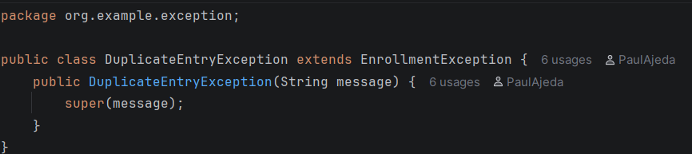
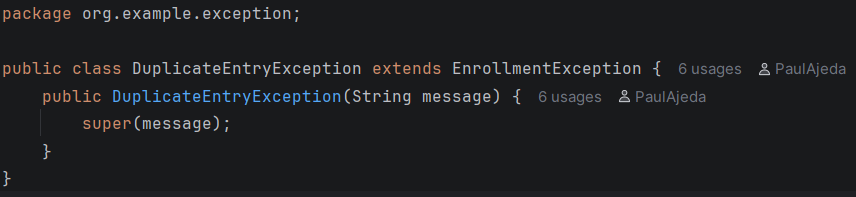

**Phase 4: Bonus Automated Testing**

The system includes **JUnit 5 Unit Tests** to prove business logic works correctly:
- Capacity limit validation (Throws Exception if full).
- Accurate tuition calculation (Units * 500).
- Duplicate Student ID prevention.
- Payment balance tracking.
- Instructor-to-section assignment.

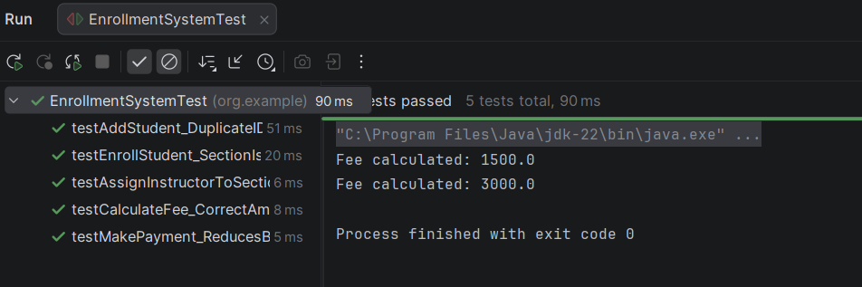

