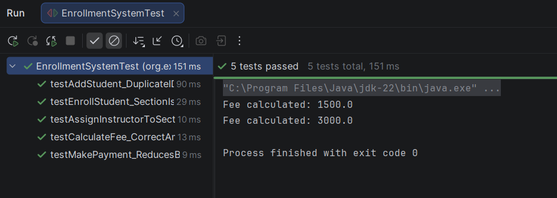

# Enrollment Management System
**Author:** Paul Geneo Ajeda

---

##  Project Overview
The Enrollment Management System is a Java project that uses Object-Oriented Programming (OOP) principles to manage manages students, courses, sections, and tuition payments using a structured and organized design with interfaces and service classes. It applies proper validation, basic business rules, and GitHub version control to simulate a real-world enrollment system.

---

## 1. Data Encapsulation
The system ensures data integrity by utilizing private attributes and public getters and setters to control all state modifications.

---

## 2. Service Layer Architecture
Business logic is separated into a dedicated service layer to decouple operational actions from data entities.

---

## 3. Inheritance
A hierarchical relationship is established where Student and Instructor classes inherit shared attributes from a base Person class.

**Base Class (Person):**

**Subclasses:**
 

---

## 4. Abstraction
The Person class is defined as an abstract template to enforce consistent polymorphic behavior across all specialized subclasses.

 
  

---

## 5. Interface-
All business operations are defined through Java Interfaces to create a modular, contract-based architecture.

 
 
 

---

## 6. Extended Entities
The system includes specialized modules for Section, Department, and Tuition management to simulate a comprehensive university structure.

### [1] Section Management
  

### [2] Department Management
  

### [3] Tuition Fee Management
 

---

## 7. Phase 1: Architectural Shift
The codebase was refactored to strictly separate data models from service implementations using formal interface contracts.

  
  

---

## 8. Phase 2: Minimum Coding Requirements including Advance Input Validation
The system supports institutional hierarchy traversal and enforces strict section capacity limits through custom exception handling.

  
   

---

## 9. Phase 4: Unit Testing (JUnit 5)
Automated unit tests were implemented to verify the accuracy of tuition calculations and the integrity of capacity validation logic.

---
